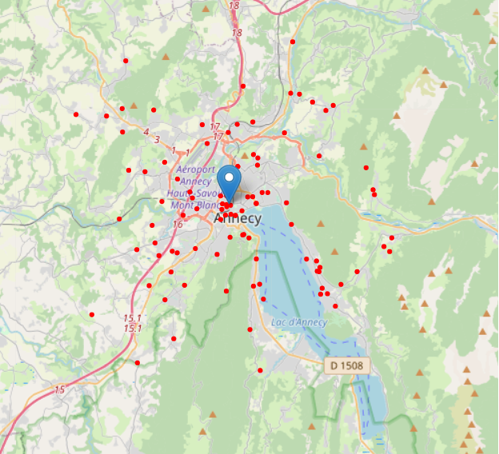
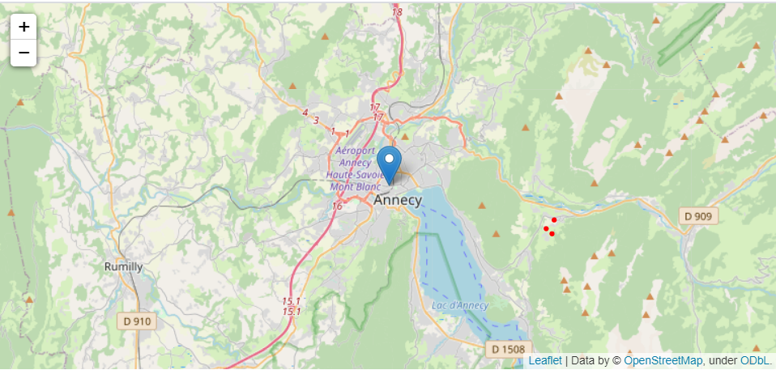
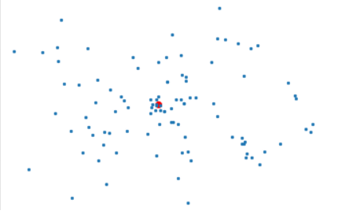
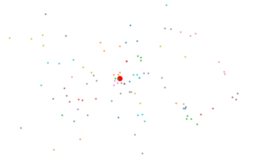

# Carpooling

Keywords:  
carpooling, optimisation, API, asynchronous requests.

## Description

Intra-company carpooling optimisation. All users (employees) need to go to the same destination (company address). The number of passengers (including driver) is a model parameter (4 in the test example below).

## Example

### Data

Using Annecy's city council as the target destination and 100 randomly generated addresses in a 10 km radius around this address

### Initial map

  
<em>
Blue marker = target destination  
Red dots = employees' addresses
</em>

### Results after optimisation

| Set up | Distance | Number of cars |
| --- | --- | --- |
| No sharing | 638 km | 100 |
| Carpooling | 320 km | 40 |

Total distance saved: 318 km

### Focus on a group

The 3 red points below represent employees identified as carpoolers by the algorithm.  

Sum of individual distances: 41 km  
Carsharing distance: 15.5 km  
Distance saved: 25.5 km  

## Algorithm

### Initial processing

Addresses are converted to GPS coordinates using a generic API (BANFrance)  
GPS coordinates are also translated to cartesian coordinates (using the target address as the origin)

### Clustering

The objective is to group together nearby points (employees) with each group containing maximum 4 passengers.

Points are grouped using k-means algorithm. We cannot know k a priori so starting from all points, we split in 2. Each subgroup is iteratively split further until it has less than 4 points (maximum number of people in a car).

### Optimise groups

At this stage, we only get candidate groups. We need to check whether it would be optimal to further split that group.  
Nota: a group may contain a maximum of four points  
Distances between points are calculated using osrm API (see http://project-osrm.org/)  

Heuristics used:  
1) sort points from closest to furthest from target address  
2) one path will necessarily go from closest point to target address  
3) for all points except the closest, branch to target address or closest existing path, depending on which is closest  
4) we obtain a list of paths, where each path consists of addresses
5) for each path, we also calculate non optimised distances (individual path from employees to target address) and optimised path distance

## Going further

1) The current algorithm assumes all employees have a car and may be the starting point of a chain. This assumption should be relaxed for a more realistic approach.  
2) Incorporating carpooling areas in the algorithm on top of employee addresses.  
3) Adding public transport network in the algorithm (much more complicated)  
4) Incorporating a metric for vehicle emissions and using this metric rather than total distance in the minimization algorithm.

## Packages Required

### setting up the Virtual environment

$ conda config --prepend channels conda-forge  
$ conda create -n covoiturage --strict-channel-priority osmnx jupyterlab  
$ conda install geopy
$ conda install -c conda-forge aiohttp
$ conda activate covoiturage  
$ python -m ipykernel install --user --name covoiturage  
$ jupyter lab
